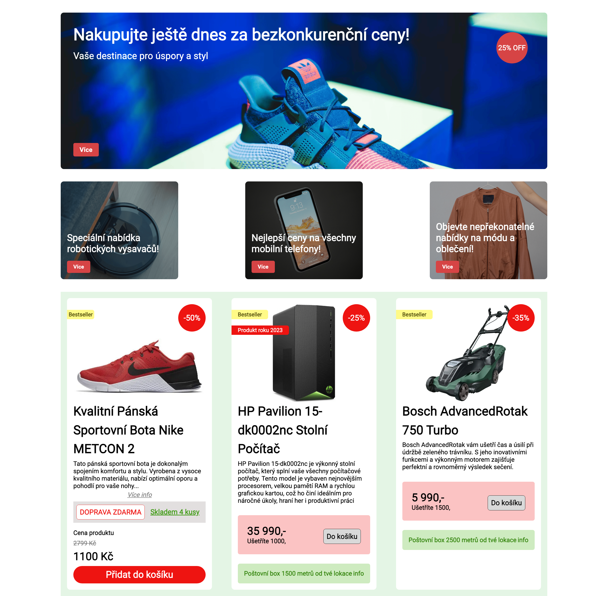

# 1. Layout

- nastavte `margin` a `padding` pro všechny elementy na `0px`
- nastavte `box-sizing` na `border-box`
- použijte font písma `Roboto`
- pro obsah stránky vytvořte blokový element s třídou `content`, do kterého budete vkládat všechen obsah
- pro element s třídou `content` nastavte šiřku na `70%`,
- element zacentrujte na střed
- element odsaďte `32px` od horní hrany stránky

```css
* {
  margin: 0;
  padding: 0;
  box-sizing: border-box;
}

body {
  font-family: Roboto, sans-serif;
}

.content {
  width: 70%;
  margin: 0 auto;
  margin-top: 2rem;
}
```

- pro viewport do šířky `768px` nastavte šířku elementu s třídou content na `90%`

# 2. Hero section

- nastavte `background-image` na elementu s třídou `hero-section`
- použijte image s nazvem `hero-section-img.png`
- nastavte velikost obrázku
- vycentrujte obrázek
- zabrántě opakováni obrázku
- výšku nastavte na `400px`
- border radius na `8px`
- padding `32px`

- pro viewport do šířky `768px` nastavte velkost `h1` elementu na `32px`
- skryjte `sale-badge` pro šířku viewportu nad `1200px`

# 3. Promo section

- na elementech s třídou promo-card-1 až 3 nastavte nasledujíci vlastnosti:
- výška nastavte na `250px`
- šířku `300px`
- `border-radius` na `8px`
- nastavte velikost obrázku
- vycentrujte obrázek
- zabrántě opakováni obrázku
- pro promo karty nastavte obrazky: `vysavac.png`, `mobil.png` a `clothes.png`

- na elementu `promo-section` nastavte aby se potomci uspořádali vedle sebe
- potomkov `promo-section` zarovnejte na vodorovné ose s mezerami
- nastavte aby se potomci zalomili na nový řádek v případe když nebudu mít dostatek místa
- nastavte mezeru mezi potomkami na `16px`

# 4. Card section

- mezi element s třídou `cards-section` vložte tři e-shopové karty, které jsme vytvářeli na druhé lekci a které byli současti domáciho úkolu
- pozor při vkládani css kodu jednotlivých karet. Může se stát, že karty mají rovnake třídy ale s jinými css vlastnostama, proto se může stát, že nekteré vlastnosti budou přepsane. V tomto případe musíte upravit názvy tříd jednotlivých karet.
- na elementu `cards-section` nastavte aby se potomci uspořádali vedle sebe
- potomkov `cards-section` zarovnejte na vodorovné ose s mezerami
- nastavte aby se potomci zalomili na nový řádek v případe když nebudu mít dostatek místa
- nastavte mezeru mezi potomkami na `16px`

Úkol by měl vypadat nasledovně:

